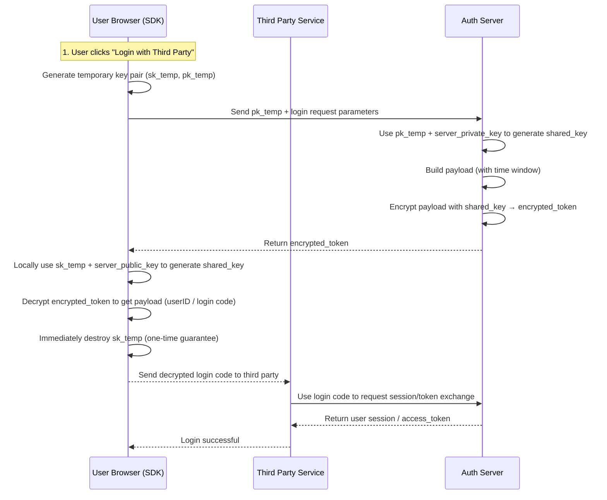

# ECDH OAuth Flow

This diagram illustrates the complete ECDH-encrypted OAuth flow:

## Flow Explanation

1. **User initiates login**: User clicks "Login with Third Party" button
2. **Temporary key generation**: Browser generates a temporary ECDH key pair
3. **Key exchange**: Client sends its public key to the auth server
4. **Shared secret derivation**: Both parties compute the same shared secret using ECDH
5. **Token encryption**: Server encrypts the OAuth token with the shared secret
6. **Token decryption**: Client decrypts the token using its temporary private key
7. **Key destruction**: Client immediately destroys the temporary private key for security
8. **Token exchange**: Client sends the decrypted code to the third-party service
9. **Session creation**: Third-party service exchanges the code for a session/token

## Security Features

- **Forward Secrecy**: Each session uses a new temporary key pair
- **One-Time Keys**: Temporary private keys are destroyed immediately after use
- **Time Windows**: Encrypted tokens include timestamps to prevent replay attacks
- **Authenticated Encryption**: AES-256-GCM provides both confidentiality and authenticity
