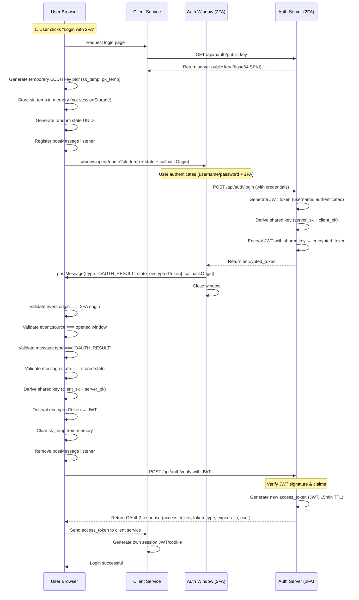

# ECDH OAuth Flow

This diagram illustrates the complete ECDH-encrypted OAuth flow with OAuth2-like token verification:

## Flow Explanation

1. **Get Server Public Key**: Client fetches the current server public key from `/api/oauth/public-key` endpoint (no need to store in client config)
2. **User initiates login**: User clicks "Login with 2FA" button
3. **Temporary key generation**: Browser generates a temporary ECDH key pair (client private key + client public key)
4. **State generation**: Client generates a random UUID for CSRF protection
5. **PostMessage listener**: Client registers a `window.addEventListener('message')` listener to receive the OAuth result
6. **Open auth window**: Client opens a new window via `window.open()` to the auth server with client public key, state, and callback origin
7. **User authentication**: User authenticates on the 2FA service in the opened window (username/password + 2FA)
8. **Token generation**: Server generates a JWT token containing user identity and authentication status
9. **Shared secret derivation**: Both parties compute the same shared secret using ECDH (server private key + client public key)
10. **Token encryption**: Server encrypts the JWT token with the shared secret using AES-256-GCM
11. **PostMessage callback**: Auth window sends encrypted token via `window.opener.postMessage()` with strict origin validation
12. **Security validation**: Client validates:
    - `event.origin` matches the 2FA service origin
    - `event.source` matches the opened window reference
    - `message.type` is `'OAUTH_RESULT'`
    - `message.state` matches the stored state
13. **Token decryption**: Client decrypts the token using its temporary private key (stored in memory) and server public key
14. **Key cleanup**: Client immediately clears the temporary private key from memory and removes the postMessage listener
15. **Token verification**: Client sends the decrypted JWT to `/api/auth/verify` endpoint
16. **Access token issuance**: Auth server verifies the JWT and issues a new access token (OAuth2-compliant)
17. **Session creation**: Client service receives the access token and generates its own session JWT/cookie

## Security Features

- **Forward Secrecy**: Each session uses a new temporary key pair
- **One-Time Keys**: Temporary private keys are stored only in memory and cleared immediately after use
- **State Validation**: Random UUID prevents CSRF attacks
- **PostMessage Security**: Multiple layers of validation ensure message authenticity:
  - Origin validation (`event.origin`)
  - Source window validation (`event.source`)
  - Message type validation
  - State parameter validation
- **No URL Exposure**: Encrypted tokens are never exposed in URL parameters, preventing:
  - Browser history leaks
  - User copy/paste sharing
  - Referrer header exposure
- **Authenticated Encryption**: AES-256-GCM provides both confidentiality and authenticity
- **Dynamic Public Key**: Server public key is fetched dynamically, enabling seamless key rotation
- **OAuth2-Compatible**: Token verification endpoint follows OAuth2 standards for access token issuance
- **Whitelist Protection**: Public endpoints are protected by origin whitelist validation

## Key Endpoints

### `/api/oauth/public-key` (GET)

- Returns the current server ECDH public key in base64 SPKI format
- Protected by origin whitelist
- Enables dynamic key distribution without client redeployment

### `/api/auth/verify` (POST)

- Verifies the decrypted JWT token from the OAuth callback
- Returns OAuth2-compliant response with new access token
- Protected by origin whitelist
- Access token is a new JWT with 15-minute expiration
