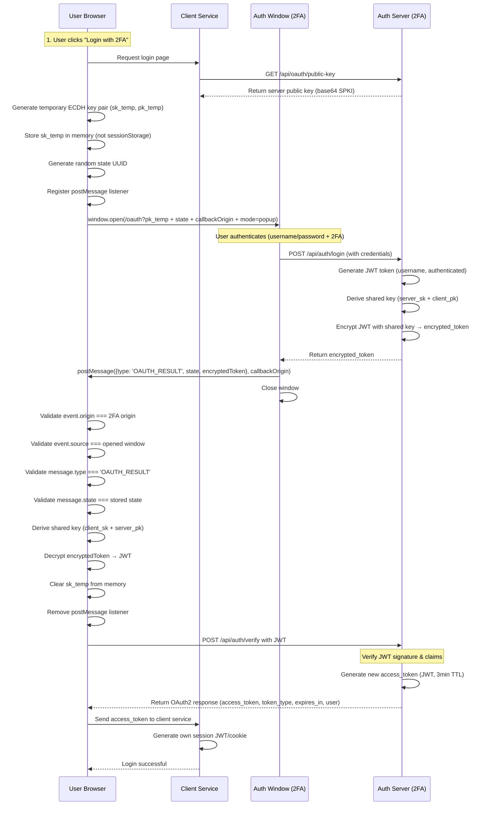
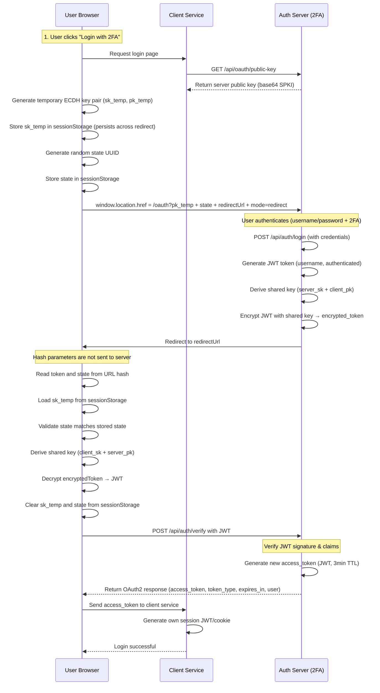

# ECDH OAuth Flow

This document describes the complete ECDH-encrypted OAuth flow with OAuth2-like token verification. The flow supports two modes: **Popup** (postMessage) and **Redirect** (URL hash).

## Flow Modes

### Popup Mode (Default)

- Uses `window.open()` to open authentication in a popup window
- Token delivery via `postMessage` API
- Key pair stored in **memory** (cleared after use)
- More secure: tokens never appear in URL
- Better UX: no page navigation

### Redirect Mode

- Uses `window.location.href` for full-page redirect
- Token delivery via URL **hash** (`#token=...&state=...`)
- Key pair stored in **sessionStorage** (persists across redirect)
- More compatible: works in all browsers and scenarios
- Hash parameters are not sent to server (more secure than query params)

## Popup Mode Flow

## Redirect Mode Flow

## Flow Explanation

### Common Steps (Both Modes)

1. **Get Server Public Key**: Client fetches the current server public key from `/api/oauth/public-key` endpoint (no need to store in client config)
2. **User initiates login**: User clicks "Login with 2FA" button
3. **Temporary key generation**: Browser generates a temporary ECDH key pair (client private key + client public key)
4. **State generation**: Client generates a random UUID for CSRF protection
5. **User authentication**: User authenticates on the 2FA service (username/password + 2FA)
6. **Token generation**: Server generates a JWT token containing user identity and authentication status
7. **Shared secret derivation**: Both parties compute the same shared secret using ECDH (server private key + client public key)
8. **Token encryption**: Server encrypts the JWT token with the shared secret using AES-256-GCM
9. **Token decryption**: Client decrypts the token using its temporary private key and server public key
10. **Token verification**: Client sends the decrypted JWT to `/api/auth/verify` endpoint
11. **Access token issuance**: Auth server verifies the JWT and issues a new access token (OAuth2-compliant)
12. **Session creation**: Client service receives the access token and generates its own session JWT/cookie

### Popup Mode Specifics

- **Key storage**: Private key stored in memory (`memoryKeyPairRef`), cleared immediately after use
- **Token delivery**: Via `postMessage` API with strict validation
- **Security validation**: Multiple layers of validation:
  - `event.origin` matches the 2FA service origin
  - `event.source` matches the opened window reference
  - `message.type` is `'OAUTH_RESULT'`
  - `message.state` matches the stored state
- **Cleanup**: Private key cleared from memory and postMessage listener removed

### Redirect Mode Specifics

- **Key storage**: Private key stored in `sessionStorage`, persists across page redirect
- **Token delivery**: Via URL hash (`#token=...&state=...`)
- **Hash security**: Hash parameters are not sent to server (more secure than query params)
- **State validation**: State loaded from `sessionStorage` and compared with URL hash parameter
- **Cleanup**: Private key and state cleared from `sessionStorage` after use

## Security Features

- **Forward Secrecy**: Each session uses a new temporary key pair
- **One-Time Keys**: Temporary private keys are cleared immediately after use
- **State Validation**: Random UUID prevents CSRF attacks
- **Popup Mode Security**: Multiple layers of validation ensure message authenticity:
  - Origin validation (`event.origin`)
  - Source window validation (`event.source`)
  - Message type validation
  - State parameter validation
- **Redirect Mode Security**: Hash parameters provide additional security:
  - Hash is not sent to server (prevents server-side logging)
  - Hash is not included in referrer headers
  - Hash is not stored in browser history (in some browsers)
- **No URL Exposure (Popup)**: Encrypted tokens are never exposed in URL parameters, preventing:
  - Browser history leaks
  - User copy/paste sharing
  - Referrer header exposure
- **Authenticated Encryption**: AES-256-GCM provides both confidentiality and authenticity
- **Dynamic Public Key**: Server public key is fetched dynamically, enabling seamless key rotation
- **OAuth2-Compatible**: Token verification endpoint follows OAuth2 standards for access token issuance
- **Whitelist Protection**: Public endpoints are protected by origin whitelist validation
- **Token Replay Protection**: Optional token replay protection using Vercel KV (configurable)
- **HTTPS Enforcement**: In production, all API endpoints require HTTPS (except localhost and local IP addresses)

## Key Endpoints

### `/api/oauth/public-key` (GET)

- Returns the current server ECDH public key in base64 SPKI format
- Protected by origin whitelist
- Enables dynamic key distribution without client redeployment
- **HTTPS Required**: In production, requires HTTPS (localhost and local IP addresses are exempt)
- Cache control: `no-cache, must-revalidate` to prevent stale key caching

### `/api/auth/verify` (POST)

- Verifies the decrypted JWT token from the OAuth callback
- Returns OAuth2-compliant response with new access token
- Protected by origin whitelist
- Access token is a new JWT with 3-minute expiration (180 seconds)
- Optional replay protection can be enabled via configuration
- **HTTPS Required**: In production, requires HTTPS (localhost and local IP addresses are exempt)

## Mode Selection

The mode is determined by the `mode` parameter in the redirect URL:

- `mode=popup`: Uses popup window with postMessage
- `mode=redirect`: Uses full-page redirect with URL hash

The mode parameter is automatically added to the redirect URL when calling `startLogin()`. The default mode is `popup`.
